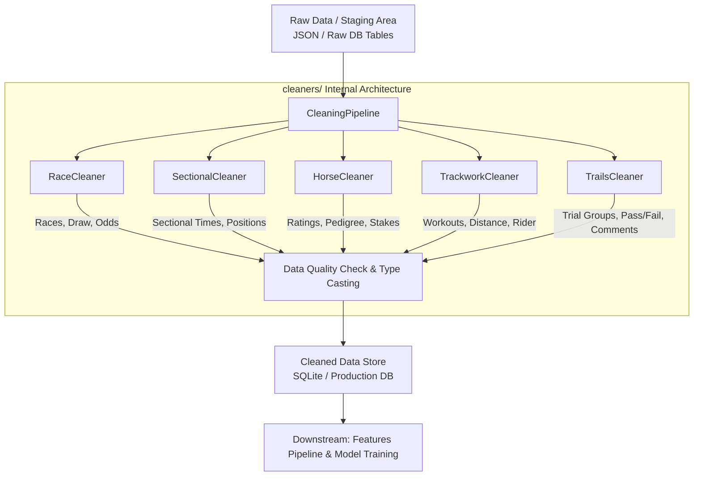

# 🧹 Cleaners Module (`cleaners/`)

Welcome to the **Data Cleaning & Transformation Layer** of the HKJC Horse Racing Quantitative System.

This module serves as a pure Python business logic layer responsible for flattening, handling missing/outlier data, enforcing type casting, and normalizing raw crawled JSON files or staging database records. It produces standardized, high-quality clean data essential for downstream feature engineering pipelines (`features/`) and quantitative model training (`models/`).

> ⚠️ **Module Disclaimer**:
> `cleaners/` is a **pure data cleaning and transformation module**. It contains no direct execution entrypoints, standalone scripts, or CLI commands. Import its Python API into data pipelines or system services for integration.
> 
> 

---

## 📁 Directory Structure

```text
cleaners/
├── __init__.py              # Module exports and package initialization
├── cleaner_pipeline.py      # CleaningPipeline (Master orchestrator & controller)
├── horses_cleaner.py        # HorseCleaner (Horse profiles, ratings & pedigree cleaner)
├── races_cleaner.py         # RaceCleaner (Race metadata, results & placings cleaner)
├── sectional_cleaner.py     # SectionalCleaner (Sectional times, positions & margin cleaner)
├── trackwork_cleaner.py     # TrackworkCleaner (Trackwork, workouts & rider cleaner)
└── trails_cleaner.py        # TrailsCleaner (Barrier trials metadata & individual results cleaner)

```

---

## 🔄 Data Processing Flow & Architecture

Data flows from the raw storage layer to standardized production database tables through the following architecture:



---

## ⚙️ Core Module Responsibilities

| File Name | Core Class | Responsibilities & Processing Logic |
| --- | --- | --- |
| **`cleaner_pipeline.py`** | `CleaningPipeline` | **Master Controller**: Unifies and orchestrates task dependencies across individual cleaners. Manages execution order for both full and incremental data cleaning tasks, exposing unified Python APIs.

 |
| **`races_cleaner.py`** | `RaceCleaner` | **Race & Result Cleaning**: Cleans race dates, venues, track conditions, distance, class, finish placings, win odds, draw values, actual weights, and trainer/jockey strings. Merges rating lookup tables.

 |
| **`sectional_cleaner.py`** | `SectionalCleaner` | **Sectional Data Cleaning**: Parses and flattens sectional times, running positions (e.g., `4-4-2-1`), conversion of minutes/seconds to float seconds, and margin behind handling.

 |
| **`horses_cleaner.py`** | `HorseCleaner` | **Horse Profile Cleaning**: Normalizes horse brand codes, age/origin, color/sex, import types, season/total stakes, win/place records, location arrival dates, and sire/dam pedigree info.

 |
| **`trackwork_cleaner.py`** | `TrackworkCleaner` | **Trackwork Cleaning**: Parses daily trackwork records, extracting workout time in seconds, rider/trainer, track surface, distance, gear, and sectional counts while mapping horse names to horse IDs.

 |
| **`trails_cleaner.py`** | `TrailsCleaner` | **Barrier Trial Cleaning**: Structures trial group metadata (trial ID, venue, track type, finish time) and individual horse trial results (draw, margin, pass/fail remarks, sentiment comments).

 |

---

## 🛠️ Data Quality Rules

To preserve quantitative pipeline integrity and model stability, all classes inside `cleaners/` strictly enforce the following rules:

### 1. Type Casting

* **Numeric Fields**: Placings, odds, weights, and margins are parsed and cast into `float32` or nullable integer types.


* **Temporal Fields**: Dates and workout/race timestamps are converted into standard `YYYY-MM-DD` strings or float seconds.


### 2. Missing Values & Outliers

* **Withdrawn & Non-Finishing Horses**: Special HKJC codes (`WV`, `FE`, `DNF`, `PU`, `DISQ`) are filtered or tagged appropriately to prevent contaminating downstream training datasets.


* **Margin Conversion**: Text margins (e.g., `Nose`, `Short Head`, `Neck`, `3-3/4L`) are normalized to standardized floating-point lengths (e.g., `0.05`, `0.1`, `0.3`, `3.75`).


### 3. Text Normalization

* **Standardized Schema**: Database columns adhere strictly to lower `snake_case` (e.g., `race_id`, `horse_id`, `finish_time_sec`, `win_odds`).


* **Noise Removal**: Trims whitespace, cleans non-breaking space characters (`\xa0`), and strips brand code parenthetical suffixes from horse names.


---

## 💻 Code Integration & API Examples

The `cleaners/` library can be imported directly into orchestration scripts or feature pipelines.

### Example 1: Executing Full Cleaning Pipeline via `CleaningPipeline`

```python
from cleaners.cleaner_pipeline import CleaningPipeline

# Initialize the master pipeline
pipeline = CleaningPipeline()

# Process and persist race & sectional data to database
pipeline.run(action="race_sectional")

# Process horse profiles, trackwork, and barrier trials independently
pipeline.run(action="horse")
pipeline.run(action="trackwork")
pipeline.run(action="trails")

```

### Example 2: Programmatically Inspecting Cleaned Data Outputs

```python
from cleaners.cleaner_pipeline import CleaningPipeline

pipeline = CleaningPipeline()

# Execute cleaning without writing directly if invoking sub-cleaners
race_data = pipeline.race_cleaner.process()
df_races = race_data["races"]
df_results = race_data["race_results"]

print(f"Cleaned Races Count: {len(df_races)}")
print(df_results[["race_id", "horse_id", "placing", "win_odds", "finish_time_sec"]].head())

```

### Example 3: Running Standalone Cleaning for Trackwork Data

```python
from cleaners.trackwork_cleaner import TrackworkCleaner

cleaner = TrackworkCleaner()

# Process raw trackwork JSON files with debug summary enabled
df_trackwork = cleaner.process(debug=True, sample_size=5)

# Output summary columns
print(df_trackwork[["horse_id", "work_date", "track_type", "work_time_sec", "rider"]].head())

```

### Example 4: Running Standalone Cleaning for Barrier Trials Data

```python
from cleaners.trails_cleaner import TrailsCleaner

cleaner = TrailsCleaner()

# Process raw barrier trial JSON files
trials_dict = cleaner.process(debug=True)

df_trials = trials_dict["trials"]
df_trial_results = trials_dict["trial_results"]

print(f"Total Trial Groups: {len(df_trials)}")
print(df_trial_results[["trial_id", "horse_id", "placing", "margin_len", "result_remark"]].head())

```

---

## 🧪 Testing & Developer Guidelines

When adding or updating cleaner logic, adhere to the following quantitative engineering principles:

1. **Idempotency**: Given identical raw input JSON files or DB tables, cleaner execution must yield identical output DataFrames.


2. **Pure Functional Logic**: Cleaner methods must work on isolated copies (`.copy()`) without mutating input objects in place.


3. **Type Annotations**: All methods must explicitly supply type hints (e.g., `df: pd.DataFrame -> Dict[str, pd.DataFrame]`).


4. **Post-Race Leakage Prevention**: Never compute rolling statistics or target aggregations inside `cleaners/`. Keep raw finished times and sectionals untouched as base fields for downstream generator processing in `features/`.